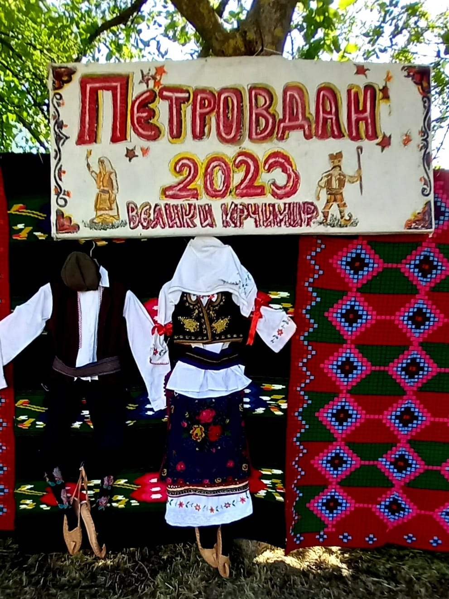
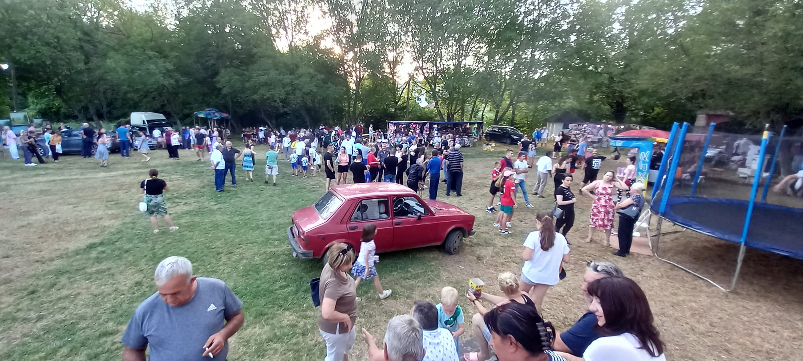
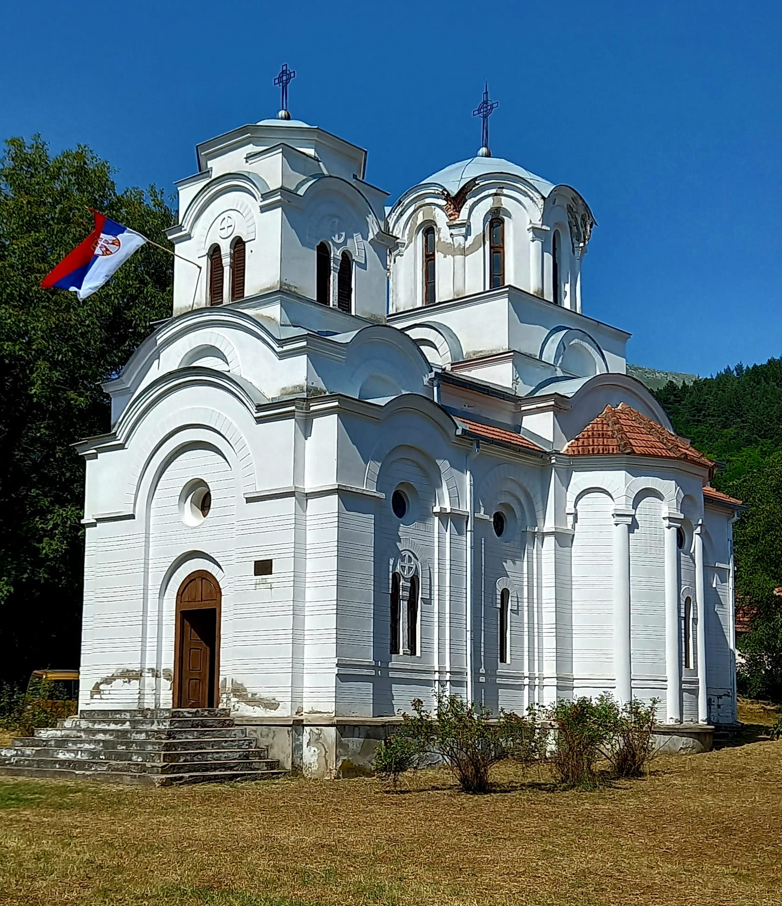
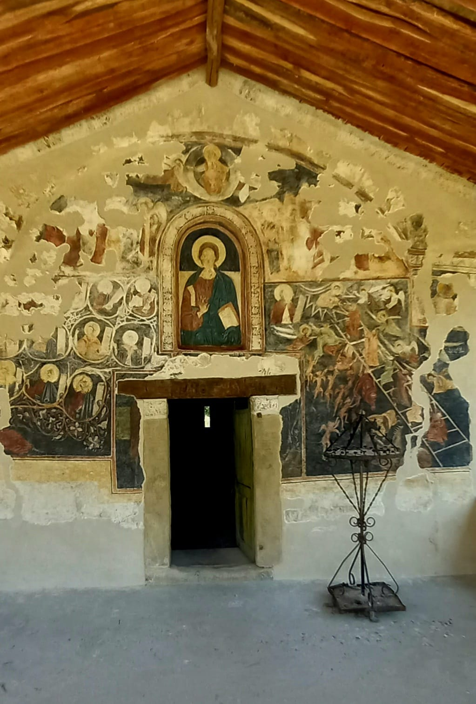
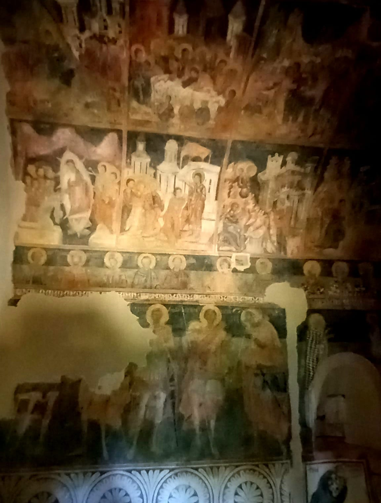
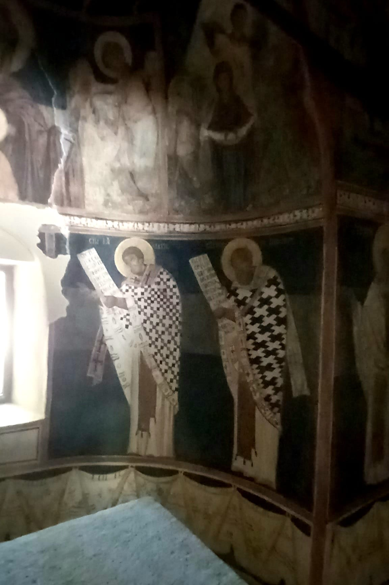

> **PETROVDAN, VELIKI KRČIMIR 12.07.2023.** 
>
> Red je poštovani prijatelji da kažemo nešto i o dvema crkvama "Vaznesenja gospodnjeg", maloj i velikoj u čijem dvorištu se i održao narodni sabor. Velika je iz novijeg doba, koja je renovirana 1992.godine. posebno je interesantna mala crkva, koja počiva na temelju iz 1069. godine, koja je obnovljena 1628. gidine, a oslikana1629. god. Posebno je interesantno da je svojevremeno ovde boravio i srpski patrijarh ARSENIJE ŠAKABENDA, jedan mesec 1728. Ili 1729. godine, pre seobe srba ove podatke sam dobio od sveštenika oca Dušana, koji služi u zaplanjskim hramovima, a danas je bio u V. Krčomiru. U nastavku pogledajte kako je oslikana mala crkva, a posebnu pažnju obratite na potpis na zidu od strane patrijarha Arsenija Šakabende, koji je po tvrdnji oca Dušana originalan. Ova mala crkva uživa status istorijskog spomenika i pod zaštitom je države. Pozdrav za sve zaplanjce ma gde bili, kao i za sve one koji vole Zaplanje.

[Mile Zaplanjac](https://www.facebook.com/groups/246453559759/user/100010287496671/)

