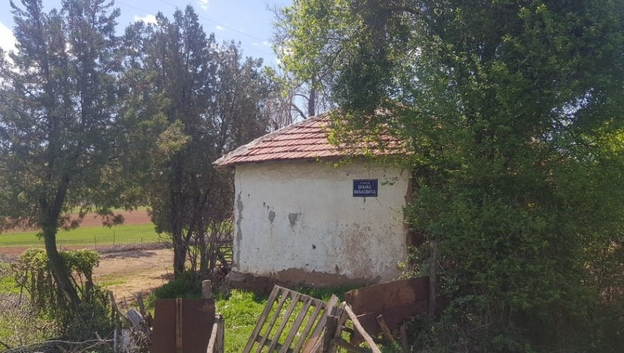

<!DOCTYPE HTML PUBLIC "-//W3C//DTD HTML 4.0 Transitional//EN">

<html>
<head>
	<meta http-equiv="content-type" content="text/html; charset=utf-8"/>
	<title></title>
	<meta name="generator" content="LibreOffice 6.4.7.2 (Linux)"/>
	<meta name="created" content="2022-12-07T15:48:32.350649447"/>
	<meta name="changed" content="2022-12-07T16:07:00.943301042"/>
	
</head>
<body lang="en-US" link="#000080" vlink="#800000" dir="ltr"><h1 class="western" align="center">
<b></b></h1>
<h3 class="western"> Бранко
је становао у Нишу, Београду, умро у
Загребу, али памти га Гаџин Хан 
</h3>

<b>Д.Миљковић
-аутор</b> 

[Вратимо Бранка кући](https://www.novosti.rs/drustvo/vesti/1114586/miljkovica-vratimo-kuci-branko-stanovao-nisu-beogradu-umro-zagrebu-ali-pamti-gadzin-han)

09. 05. 2022. у 10:34

 
 

<h3 class="western">Г<b>аџин
Хан</b> - Пространо сеоско домаћинство
са два оронула кућерка, а у једном од
њих наш највећи песник друге половине
прошлог века провео је као дете ратне
године. 
</h3>

 
 

<b>Кућа
се налази на крају улице која носи
песниково име и у њој тренутно бораве
домаће животиње. Вођени путоказима
свакодневно долазе поштоваоци поезије
Бранка Миљковића и сваког од њих затекне
и пренерази исто разочарење, заслужио
је Бранко боље од овога, коментар је
већине.</b>

<b>Бранку
се као место становања наводе Ниш,
Београд и Загреб, где је трагично скончао
1961. године, али се за његов дом сматра и
Гаџин Хан, где је на имању деда Луке
безбедно провео ратне године, а чак је
и основну школу похађао у овој вароши.
Из дворишта се пружа нестваран поглед
ка Сувој планини, а у животу је и стари
дуд за који се верује да је својом
хладовином заклањао младог песника док
је стварао најлепше стихове.</b>

<b>-
Тамо, испод оне јабуке, још пре 20 и више
година долазили су и обећали да ће му
поставити споменик. Било је договорено
и кућа да се реновира, среди двориште,
поставе клупе, али тако је како је, прича
нам Влада Миљковић, рођак покојног
песника који добро памти дружења са
старијим братом од стрица.</b>

<b>-
Старији је од мене десет година, али је
као школарац долазио да чува стоку.
Носио је књиге свуда са собом и обично
би засео у неку хладовину а мене слао
да враћам стадо...</b>

