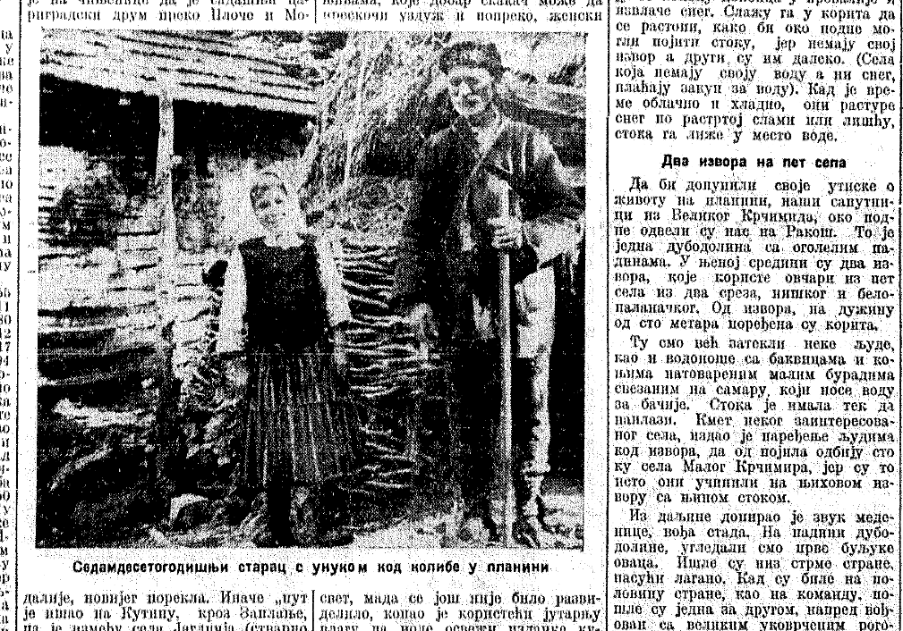

### [Црква Света Петка](https://projekti.filfak.ni.ac.rs/stiutz/zanr/predanja/kulturno-istorijska/item/173-crkva-sveta-petka)

### [Културно–историјска предања](https://projekti.filfak.ni.ac.rs/stiutz/zanr/predanja/kulturno-istorijska) 

А тај црква, кажу, била, некада у старо време, тој су стари причали, овде горе – изнад малко, има црeпана, туј. Света Петка ву зовемо – и тој место се зове, кажу, по туј цркву. Правена туј црква, звала се света Петка. Али, кажу, але дошле ву дигну па ву однесу горе у манастир куде је саг. Тако причу, да л' је то стварно. А једни људи кажу ратови били, па због рат близу, поред овај главни пут, па однешена горе. Али увек су ни тој причали, кажу, тој место се зове по туј цркву, Света Петка, црква. Кажу, але ју дигну одотле па однесу у манастир, и после горе тај црква направљена. Да л' је тој стварно, да ли?... Але не дале туј да буде, него је носиле горе у манустир. Мора да су оне имале њен си неки... тако се тој причало. ...

[„Политика”, 4. јул 1935](https://digitalna.nb.rs/wb/NBS/Periodika/SD_2F6F6602455A67B1B521D786232CBF4A/1935/07/04?pageIndex=00007)